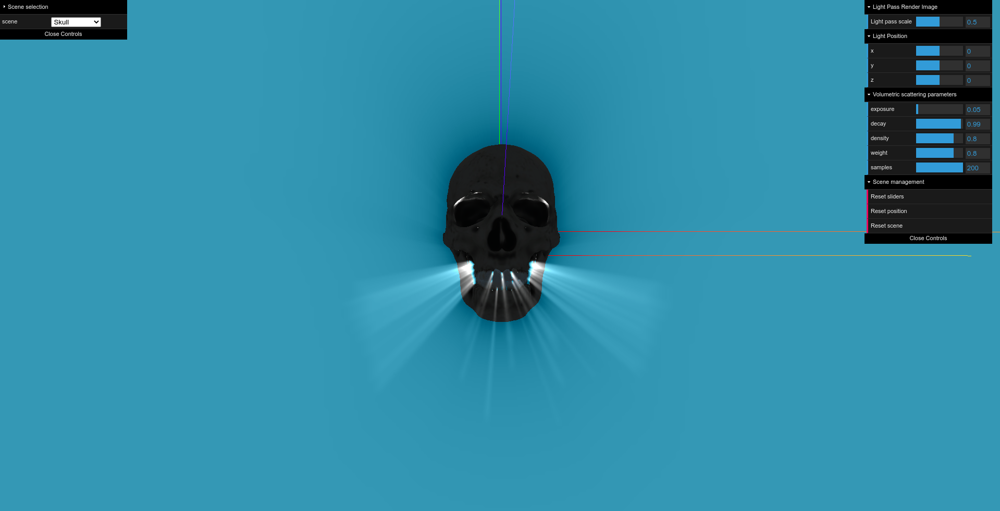
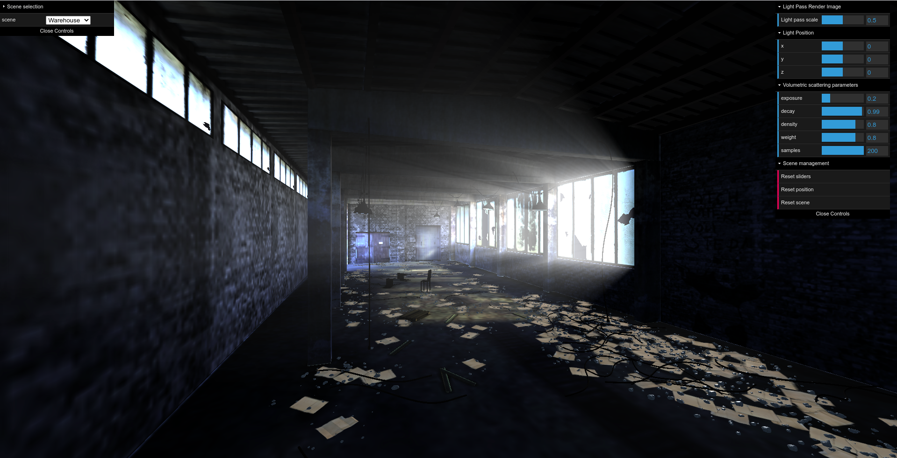
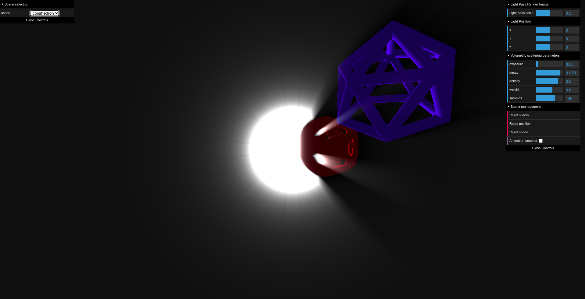
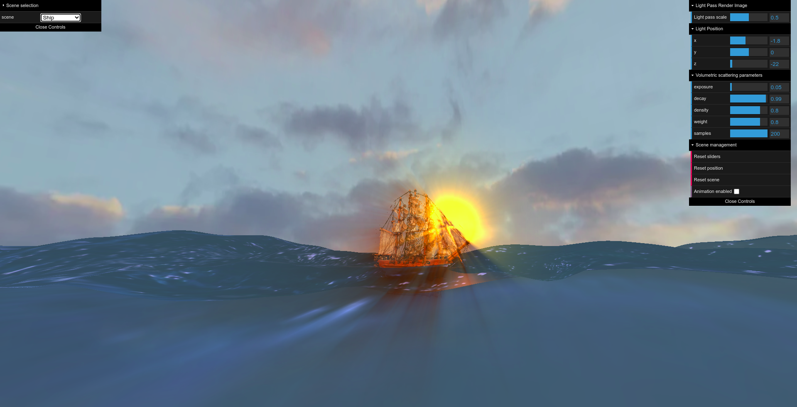
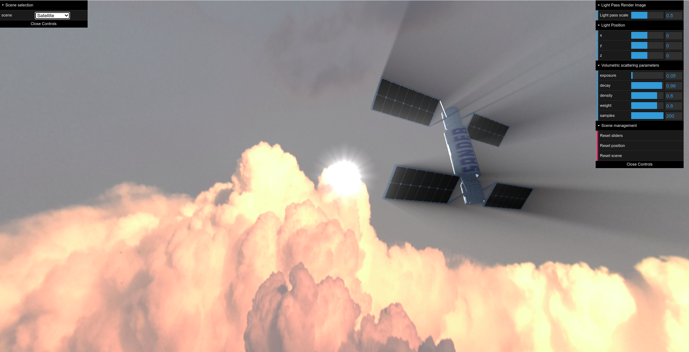

# dawntime


## Table of Contents

* [About the Project](#about-the-project)
  * [Built With](#built-with)
* [Installation](#installation)
* [Usage](#usage)
* [Screenshots](#screenshots)
* [Authors](#authors)
* [Credits](#credits)
* [Acknowledgments](#acknowledgments)


## About The Project

In ```dawntime``` we implement a volumetric light scattering effect based on the postprocessing technique described by Kenny Mitchell [here](https://developer.nvidia.com/gpugems/gpugems3/part-ii-light-and-shadows/chapter-13-volumetric-light-scattering-post-process).

This project contains five demostrations scene which implement the volumetric light scattering technique linked above.

### Built With

* [Typescript](https://www.typescriptlang.org/)
* [Webpack](https://webpack.js.org/)
* [Three.js](https://threejs.org/)


## Installation

To get a local copy up and running follow these simple steps:

1. Clone the repo
```sh
git clone https://gitlab.com/reddeadrecovery/dawntime
```
2. Run ```npm install``` in the root folder of the repo


## Usage

Just run ```npm start``` to start the webserver and navigate to http://localhost:8080

## Screenshots








## Authors

* [**Alberto Baldrati**](https://github.com/ABaldrati)
* [**Giovanni Berti**](https://github.com/giovanniberti)

## Credits
3D models used:
* [Skull](https://sketchfab.com/3d-models/skull-downloadable-1a9db900738d44298b0bc59f68123393)
* [Warehouse](https://sketchfab.com/3d-models/abandoned-warehouse-interior-scene-1d5285f2e0fd4211a27c8042496d5959?)
* [Icosahedron](https://sketchfab.com/3d-models/icosahedrons-8f71d7f5d9b6432e8a0728b145ccf0e8)
* [Ship](https://sketchfab.com/3d-models/sailing-ship-model-ac65e0168e8c423db9c9fdc71397c84e)
* [Sea](https://sketchfab.com/3d-models/sea-wave-deniz-dalgas-d7788fcb55c64c7d9733fa44607aab93)
* [Satellite](https://sketchfab.com/3d-models/satellite-90c8fafa35c84e3b90601dd3ac8d202f)

## Acknowledgments
Computer Graphics and 3d © Course held by Professor [Stefano Berretti](https://scholar.google.com/citations?user=3GPTAGQAAAAJ) - Computer Engineering Master Degree @[University of Florence](https://www.unifi.it/changelang-eng.html)
